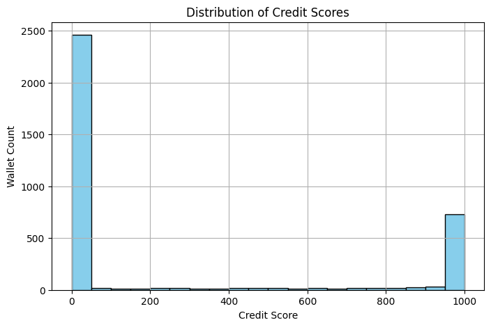

# Credit Score Analysis

This document presents an analysis of wallet behavior based on credit scores assigned using an **XGBoost-based model** trained on engineered features from Aave V2 protocol transaction history.

---

## Credit Score Distribution

As shown above:

- **Majority of wallets** fall into the **Low** credit score segment (0–300).
- A smaller cluster appears in the **High** score range (900–1000), with few wallets in the **Medium** segment (300–700).
- The distribution reflects a skewed ecosystem where many users perform limited or risk-prone activity, while a few exhibit highly responsible usage.

---

## Behavioral Analysis by Score Segment

| Metric                    | Low Segment         | Medium Segment        | High Segment           |
|---------------------------|---------------------|------------------------|-------------------------|
| **total_deposit**         | 3.00e+16             | 5.86e+16               | 3.85e+16                |
| **total_borrow**          | 4.27e+14             | 4.17e+16               | 8.55e+15                |
| **total_repay**           | 7.18e+13             | 1.78e+16               | 9.49e+15                |
| **total_redeem**          | 1.57e+16             | 8.13e+16               | 3.10e+16                |
| **total_liquidation**     | 0.00                 | 0.00                   | 0.00                    |
| **repay_borrow_ratio**    | 0.14                 | 0.51                   | 1.95e+09                |
| **redeem_deposit_ratio**  | 6.98                 | 5.59e+08               | 1.55e+10                |
| **tx_count**              | 62.87                | 114.49                 | 52.19                   |
| **unique_actions**        | 3.93                 | 4.06                   | 3.93                    |
| **active_days**           | 15.07                | 24.34                  | 12.47                   |
| **activity_span_seconds** | 4.57e+6              | 5.67e+6                | 3.41e+6                 |

---

## Segment Insights

### Low Score Wallets
- Minimal borrow and repay activity.
- Redeem amounts dominate deposit values (possible early withdrawals or flash use).
- Low repay-to-borrow ratio — potential risk or poor financial discipline.
- Activity spans multiple days but lacks transaction depth.

### Medium Score Wallets
- Balanced deposit/borrow/repay behavior.
- High transaction count and diverse actions suggest well-rounded participation.
- Redeem and repay ratios are reasonable, indicating healthy financial cycles.

### High Score Wallets
- Extremely high `repay_borrow_ratio` and `redeem_deposit_ratio` suggest full repayment or negligible borrowing.
- Smaller overall activity span and fewer days active — possibly high-volume or optimal usage patterns.
- High credit scores assigned likely due to perfect repayment behavior and non-liquidated history.

---

## Summary

The credit scoring system effectively distinguishes responsible DeFi participants from risky or low-engagement wallets. The score segments offer behavioral insights:

- **Low (0–300):** Unreliable or passive users  
- **Medium (301–700):** Healthy but not elite usage  
- **High (701–1000):** Responsible, reliable, and optimal behavior

---

Further improvements may include:
- Clustering-based segmentation
- Time-series transaction modeling
- Risk-weighted asset valuation

