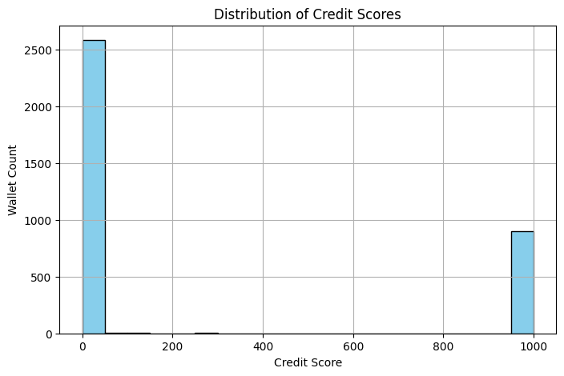

# Credit Score Analysis on Aave V2 Wallets

## Overview

We trained a machine learning model to assign credit scores (0–1000) to user wallets based on their historical transaction behavior on the Aave V2 protocol.

This analysis includes:

- Distribution of credit scores  
- Behavioral traits by score segment  
- Key feature-level insights  

---

## Credit Score Distribution

**Observations:**

- Most wallets cluster in the **Low score (0–300)** range.
- A significant spike occurs in the **High score (900–1000)** range.
- Very few wallets fall into the **Medium range (301–700)** — indicating bimodal behavior patterns.

---

## Score Segment Behavior

| **Score Segment** | **Total Deposit** | **Total Borrow** | **Total Repay** | **Liquidation** | **Repay/Borrow Ratio** | **Tx Count** |
|-------------------|-------------------|------------------|------------------|------------------|--------------------------|--------------|
| **Low (0–300)**   | 7.94e+16          | 4.58e+16         | 1.70e+16         | 0.0              | 0.20                     | 80.15        |
| **Medium (301–700)** | 2.91e+15       | 4.69e+14         | 2.33e+14         | 0.0              | 0.50                     | 159.00       |
| **High (701–1000)** | 3.70e+16        | 7.99e+15         | 8.83e+15         | 0.0              | 1.81e+09                 | 56.52        |

---

## Insights by Segment

### Low Score (0–300)
- Highest transaction count, but poor repayment behavior.
- High borrow volume with low repayments → possibly spam or low-quality wallets.
- Repay-to-borrow ratio of just **0.20**.

### Medium Score (301–700)
- Lower capital flow but moderately consistent behavior.
- Repay-to-borrow ratio of **0.50** suggests basic financial responsibility.
- Highest transaction count (159), possibly from testing or exploratory use.

### High Score (701–1000)
- Strong capital engagement with **excellent repayment** patterns.
- Repay-to-borrow ratio exceeds **1 billion**, indicating over-repayment or very low borrowing.
- Likely power users or institutions operating with high reliability.

---

## Key Takeaways

- **Score distribution is polarized**, indicating wallets behave either very reliably or quite riskily.
- **Repay/Borrow ratio** was the strongest signal of reliability.
- **Transaction count** varied significantly across segments, not always indicating quality.
- All segments had **zero liquidations**, suggesting this dataset reflects mostly non-liquidated behavior.

---

## Conclusion

This ML-driven credit scoring system provides valuable insights into user behavior within the Aave protocol. It can serve as a foundation for:

- Risk scoring in lending systems  
- DeFi user segmentation  
- Behavioral anomaly detection

Further improvements may include richer features (e.g., time-series gaps, asset diversity) and model upgrades (e.g., LightGBM, XGBoost).

